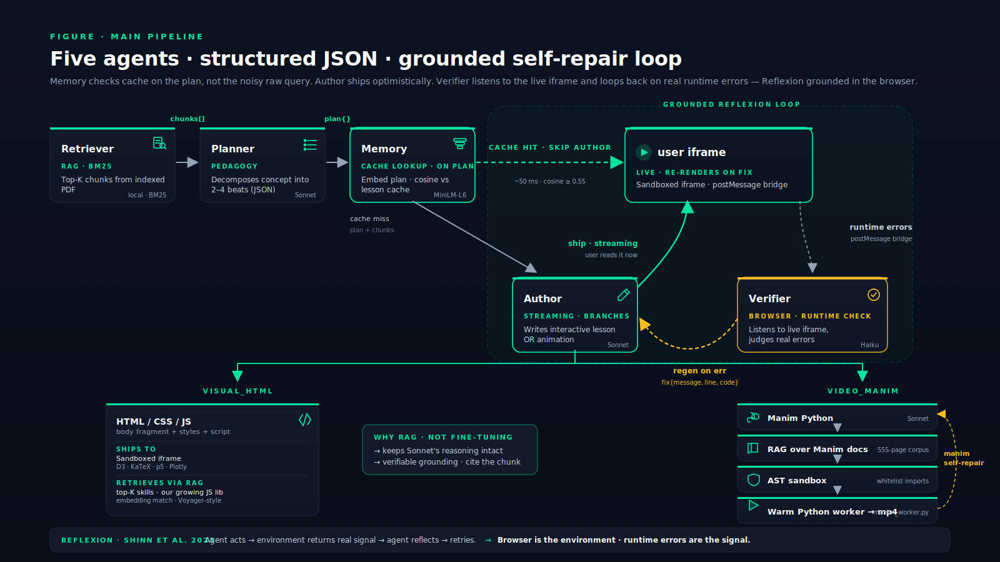
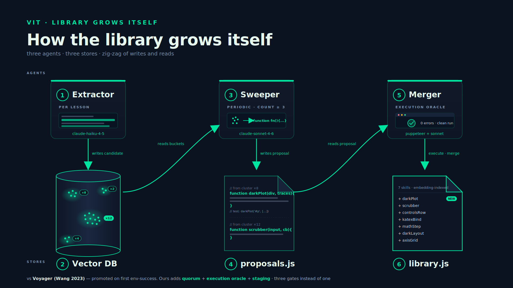

# ViT — Visual Interactive Tutor

> Highlight a concept in a PDF. Get back an interactive lesson you can drag, scrub, and play with — wired together as a knowledge graph.

ViT turns static technical reading into a generated, interactive curriculum. Highlight any passage and a multi-agent pipeline produces a runnable HTML widget or a Manim animation tailored to that exact concept. Every lesson becomes a node on a graph; highlight inside a lesson and a child node spawns. Zoom out and you see the structure of your understanding.

---

## At a glance



Five agents per generation, structured JSON between every step, and a self-repair loop grounded in your actual browser:

- **Retriever** — BM25 over the indexed PDF, top-K chunks
- **Planner** — decomposes the highlight into 2–4 teaching beats, returns a typed plan
- **Memory** — embeds the *plan* (not the noisy raw query), cosine-matches against the lesson cache. Hit → ship cached. Miss → continue.
- **Author** — streams an HTML/CSS/JS widget *or* a Manim animation, depending on user mode
- **Verifier** — listens to the live iframe via `postMessage`. On a real runtime error, sends a structured fix prompt back to Author. Iframe hot-swaps in place. Reflexion (Shinn et al. 2023) grounded in the browser.

A second system runs across generations and grows a skill library on its own:



- **Extractor** mines candidate primitives from each generation, embeds them, drops them in a vector DB
- **Sweeper** wakes when a cluster reaches quorum (≥3 independent generations) and proposes a unified function
- **Merger** runs the proposal in a real headless browser (puppeteer). Clean execution → merged into the live library. Throws → rejected.

Three gates instead of Voyager's one: quorum, execution oracle, staging.

---

## Quick start

```bash
git clone https://github.com/mohanad-hafez/ai-tutor.git
cd ai-tutor
npm install
cp .env.example .env       # add your ANTHROPIC_API_KEY
npm run dev
```

Open <http://localhost:5173/>. Drop a PDF onto the canvas. Highlight a concept. Pick `interactive` or `animation`. Watch it stream.

---

## Prerequisites

- **Node 20.11+**
- **Python 3.10+** with [`manim`](https://docs.manim.community/en/stable/installation.html) (Manim Community Edition) for the video pipeline
- **FFmpeg** on `PATH` (Manim depends on it)
- **LaTeX** (optional — for math rendering inside Manim scenes)
- An Anthropic API key

The first two are the only hard requirements. Everything else degrades gracefully.

---

## Configuration

`.env` keys (see [`.env.example`](.env.example) for the full list):

| key | default | purpose |
|---|---|---|
| `ANTHROPIC_API_KEY` | _required_ | API key |
| `ANTHROPIC_MODEL` | `claude-sonnet-4-6` | main generation model |
| `ANTHROPIC_FAST_MODEL` | `claude-haiku-4-5` | summary, quiz, classification |
| `PORT` | `8787` | API server port |
| `LESSON_CACHE` | `on` | hash + semantic lesson cache |
| `MANIM_WORKER` | `on` | warm Python worker pool (vs cold subprocess per render) |
| `CRITIC` | `off` | optional self-revision pass on HTML lessons |
| `MEMORY_*_THRESHOLD` | `0.55` | cosine thresholds for semantic cache (lower = more hits) |

---

## Architecture

```
┌─────────────────────────────────────────────────────────────────┐
│                          Browser (Vite)                         │
│  ReactFlow canvas · PDF viewer · sandboxed lesson iframes       │
└─────────────────────────────┬───────────────────────────────────┘
                              │  SSE (/api/explain)
                              ▼
┌─────────────────────────────────────────────────────────────────┐
│                    Express API (server/)                        │
│  Retriever (BM25) · Planner · Memory · Author · Verifier        │
│  Skill library (Extractor · Sweeper · Merger)                   │
└─────────────────────────────┬───────────────────────────────────┘
                              │
            ┌─────────────────┼──────────────────┐
            ▼                 ▼                  ▼
       Anthropic API     Xenova MiniLM     Manim worker pool
       (Sonnet/Haiku)    (local embeds)    (Python subprocess)
```

- **Inter-agent comms**: structured JSON via Anthropic's [forced tool-use](https://docs.anthropic.com/en/docs/build-with-claude/tool-use). Every agent's output is a typed object the next one parses without a parser.
- **RAG over Manim docs** (not fine-tuning) — keeps Sonnet's reasoning intact and gives verifiable grounding.
- **Sandboxed iframes** with `allow-scripts` only (no `allow-same-origin`) — lesson code runs in an opaque origin and can't reach this app's storage.

Full docs in [`docs/`](docs/):

- [`getting-started.md`](docs/getting-started.md) — install, env vars, first lesson
- [`usage.md`](docs/usage.md) — every feature, every keyboard shortcut
- [`architecture.md`](docs/architecture.md) — system overview, data flow, file map
- [`api.md`](docs/api.md) — Express server endpoints
- [`manim-pipeline.md`](docs/manim-pipeline.md) — how video generation works
- [`extending.md`](docs/extending.md) — customize prompts, add lesson types, swap models

---

## Stack

**Frontend**: React 19 · Vite 8 · ReactFlow · Tailwind · `react-pdf`
**Backend**: Express 5 · Anthropic SDK · `@xenova/transformers` (MiniLM-L6) · Manim Community

---

## Scripts

```bash
npm run dev          # web + api in parallel
npm run dev:web      # vite only
npm run dev:api      # tsx watch on server/
npm run build        # tsc + vite build
npm run lint         # eslint
```

---

## Status

Built for a hackathon. Code paths exist for everything in the figures; the per-generation pipeline runs by default. The live `/api/verify` loop and full Sweeper → Merger scheduling live in [`server/skillLibrary.ts`](server/skillLibrary.ts).

---

## License

MIT — see [`LICENSE`](LICENSE).
