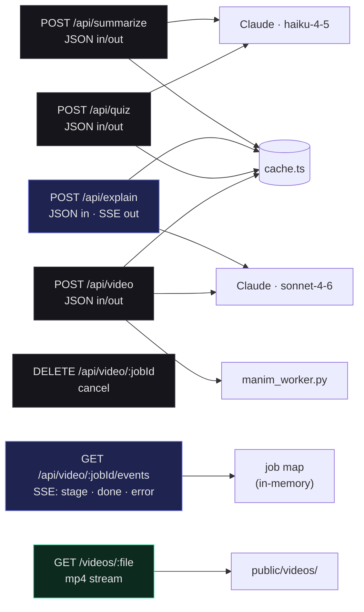
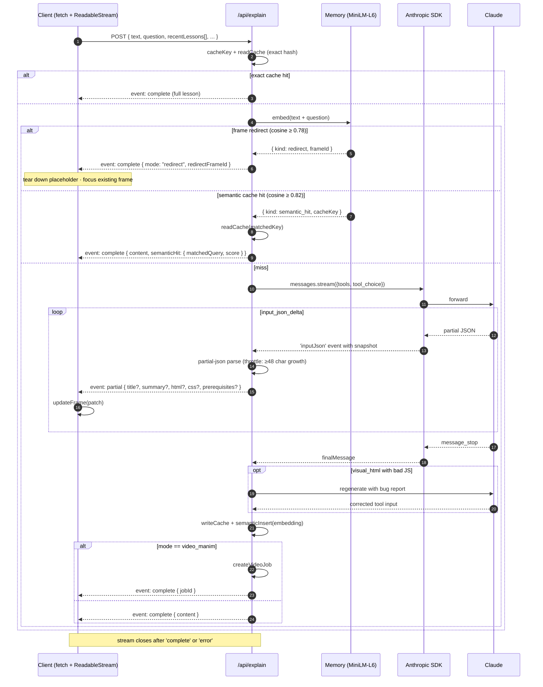
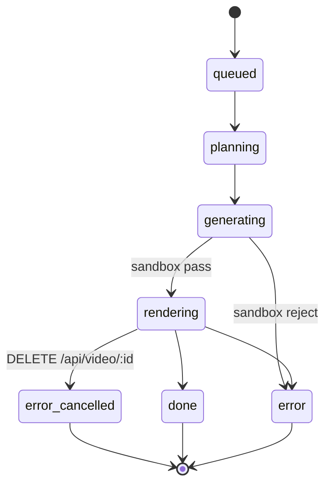

# API reference

The Express server runs on `127.0.0.1:8787` by default (override with `PORT`). In dev, Vite proxies `/api/*` to it; static `/videos/*` is served from Vite's `public/` dir.

All JSON request/response bodies use `Content-Type: application/json`. Streaming endpoints use `Content-Type: text/event-stream` (Server-Sent Events).

## Endpoint map



## `POST /api/summarize`

Generate a 150–250 word document summary used to anchor every downstream lesson in the document's domain.

### Request

```json
{ "text": "<full document text, capped to 80,000 chars on the server>" }
```

### Response 200

```json
{ "summary": "Dense prose summary…" }
```

### Errors

- `400` — missing or non-string `text`
- `500` — Anthropic error; body has `{error: string}`

## `POST /api/explain` (streaming)

The lesson router. **Always returns SSE** (`text/event-stream`). Claude picks the best lesson type and emits it via the `emit_lesson` tool. Partial tool input is streamed to the client as the model writes it, parsed server-side with `partial-json`, and pushed as `partial` events.

### Request

| Field | Type | Required | Notes |
|-------|------|----------|-------|
| `text` | string | yes | the highlighted text |
| `question` | string | no | optional user question |
| `parentTitle` | string | no | parent concept title; helps with continuity |
| `docSummary` | string | no | the summarize output |
| `docId` | string | no | id returned by `/api/summarize`; lets the Retriever fetch BM25 chunks |
| `recentLessons` | `{id, title, sourceText?}[]` | no | last 8 frames on the canvas; lets the Memory agent redirect to an existing frame instead of generating a duplicate |
| `force` | `'text' \| 'visual_html' \| 'video_manim'` | no | bypass router and force a specific mode |

### Streaming flow



### Events

#### `agent_step`

Fired once per **agent state change** as the multi-agent pipeline executes. Each step emits a `running` event followed by a terminal `done` / `error` / `skipped` event with the same `id`. The frontend uses the id to upsert the trace by replacing the matching entry in place.

```json
{
  "id": "step_3_qzxn72",
  "agent": "planner",
  "label": "Plan teaching beats",
  "model": "claude-sonnet-4-6",
  "status": "done",
  "startedAt": 1778085162656,
  "finishedAt": 1778085181064,
  "durationMs": 18408,
  "tokensIn": 1441,
  "tokensOut": 940,
  "cacheReadTokens": 0,
  "preview": "5 beats — \"Binary Trees: Hierarchical Node Organization\"",
  "detail": "Starting from the smallest possible unit (a single node)…\n\n1. What is a Node? — …\n2. Parent–Child Relationship — …"
}
```

Agent values: `memory | router | retriever | planner | author | critic | refiner`. Statuses: `pending | running | done | error | skipped`. See [architecture.md](architecture.md#agents) for what each agent does.

The **`memory`** agent runs first and may short-circuit the entire pipeline. Its `preview` and `detail` fields surface the cosine similarity score and matched query so the UI can show the user "reused 'Recurrent Neural Networks' lesson · cosine 0.87".

#### `partial`

Best-effort snapshot of the tool input parsed so far. Fields appear as the model emits them, in roughly this order: `mode`, `title`, `summary`, `prerequisites`, `html`, `css`, `js`. The client should treat each `partial` as a patch to apply.

```json
{
  "mode": "visual_html",
  "title": "Binary search",
  "summary": "Halves the search space at every step…",
  "html": "<div…>",
  "css": "body{…}"
}
```

The `js` field is intentionally not streamed mid-flight (running half-written scripts is risky). It arrives only with the `complete` event.

#### `complete` — text or visual_html

```json
{
  "mode": "text" | "visual_html",
  "title": "Concept title",
  "summary": "One-sentence preview",
  "content": { "html": "<div…>", "css": "…", "js": "…" },
  "prerequisites": [
    { "title": "Vectors", "brief": "Why understanding vectors helps with the current lesson." }
  ],
  "cached": true,
  "semanticHit": { "matchedQuery": "gradient descent…", "score": 0.875 }
}
```

`cached` is set when the exact-hash cache short-circuited the pipeline. `semanticHit` is set when the Memory agent matched a paraphrase and reused that prior generation — `matchedQuery` is the original phrasing that produced the cached lesson, `score` is the cosine similarity. Both fields are optional; absence means the lesson was generated fresh.

#### `complete` — video kicked off

```json
{
  "mode": "video_manim",
  "title": "Concept title",
  "summary": "One-sentence preview",
  "jobId": "5f3a…",
  "semanticHit": { "matchedQuery": "…", "score": 0.91 }
}
```

The client should subscribe to `GET /api/video/:jobId/events` to receive progress and the final video URL.

#### `complete` — frame redirect (Memory short-circuit)

When the Memory agent decides the new highlight is semantically equivalent to an existing lesson on the user's canvas, no new lesson is generated. Instead:

```json
{
  "mode": "redirect",
  "redirectFrameId": "f7c4-…",
  "matchTitle": "Recurrent Neural Networks",
  "score": 0.82
}
```

The frontend should remove its placeholder frame and focus `redirectFrameId`.

#### `error`

```json
{ "message": "explanation of the failure" }
```

The connection is closed after `complete` or `error`.

### Tool schema

```json
{
  "name": "emit_lesson",
  "input_schema": {
    "type": "object",
    "properties": {
      "mode":          { "enum": ["text", "visual_html", "video_manim"] },
      "title":         { "type": "string" },
      "summary":       { "type": "string" },
      "html":          { "type": "string" },
      "css":           { "type": "string" },
      "js":            { "type": "string" },
      "manim_brief":   { "type": "string" },
      "prerequisites": {
        "type": "array",
        "items": {
          "type": "object",
          "properties": {
            "title": { "type": "string" },
            "brief": { "type": "string" }
          }
        }
      }
    },
    "required": ["mode", "title", "summary"]
  }
}
```

`tool_choice` is forced to `{type: 'tool', name: 'emit_lesson'}` so the model always emits valid input.

## `POST /api/quiz`

Generate an interactive quiz frame for a concept.

### Request

```json
{
  "title": "Binary search",
  "summary": "Halves the search space at every step",
  "sourceText": "the original highlighted text (optional)",
  "docSummary": "the document summary (optional)"
}
```

### Response 200

Same shape as `/api/explain` synchronous response, with `mode: 'visual_html'`.

The generated HTML mixes at least three question types (multiple choice with per-option feedback, short answer, one interactive challenge), tracks running score, and ends with a diagnostic paragraph.

## `POST /api/video`

Direct video request — bypasses the lesson router. Use when the user explicitly clicks **Animate** instead of **Explain**.

### Request

```json
{
  "text": "the concept",
  "question": "optional user question",
  "docSummary": "optional",
  "parentTitle": "optional",
  "brief": "optional explicit brief overriding text"
}
```

Either `text` or `brief` must be provided.

### Response 200

```json
{ "jobId": "5f3a…" }
```

## `GET /api/video/:jobId/events`

Server-Sent Events stream for a video job.

### Headers

- `Content-Type: text/event-stream`
- `Cache-Control: no-cache, no-transform`
- `Connection: keep-alive`
- `X-Accel-Buffering: no`

### Lifecycle



### Events

Each event is `event: <name>` followed by a `data: <json>` line.

#### `stage`

Sent on every stage transition AND every 2 seconds while in the `rendering` stage (so `etaSec` updates live).

```json
{
  "stage": "planning" | "generating" | "rendering" | "done" | "error",
  "progress": 5 | 25 | 40 | 70 | 100,
  "message": "Planning the animation",
  "etaSec": 27
}
```

`etaSec` is omitted unless we are actively rendering AND the planning step produced a `duration_estimate`. The estimate uses `duration_estimate × 1.3` as the rough render budget at low quality.

#### `done`

Sent once when rendering completes successfully. The connection is closed after.

```json
{
  "videoUrl": "/videos/<jobId>.mp4",
  "durationSec": 28,
  "chapters": [{ "t": 0, "label": "Title" }, …],
  "title": "Concept title",
  "summary": "Animated explanation"
}
```

#### `error`

Sent if the job fails (after one self-repair attempt). The connection is closed after.

```json
{ "message": "Manim render failed twice. Last stderr: …" }
```

### Late subscribers

Connecting after the job has already finished is fine — the server immediately replays the latest `stage` event followed by the terminal `done` or `error` event before closing.

### Heartbeat

A `: ping\n\n` comment is sent every 15 seconds to keep proxies from idling out the connection.

### Cleanup

The job entry is deleted from the in-memory map 60 seconds after completion. Subscribing past that point returns `404`.

## `DELETE /api/video/:jobId`

Cancel a video job. Sends `SIGTERM` to the running render subprocess (worker or CLI), marks the job as `error` with message `"Cancelled by user"`, and emits a final `error` SSE event to all subscribers.

### Response

- `200` `{ "ok": true }` — cancelled successfully
- `404` `{ "ok": false }` — job already terminal (done/error) or unknown id

## `GET /videos/:file`

Streams the rendered MP4. Path validation rejects anything not matching `^[\w-]+\.mp4$`.

Headers:

- `Content-Type: video/mp4`
- `Cache-Control: public, max-age=86400`

In dev, Vite serves these directly from `public/videos/` without going through the API server. The route on the API server exists for production deployments where Express serves both.
