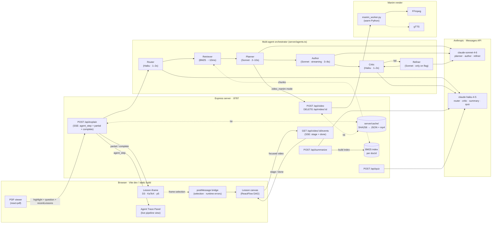
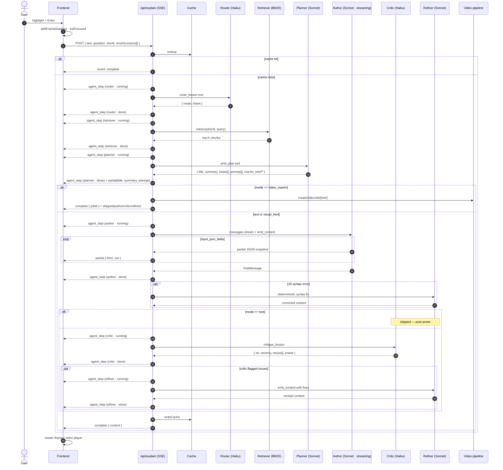
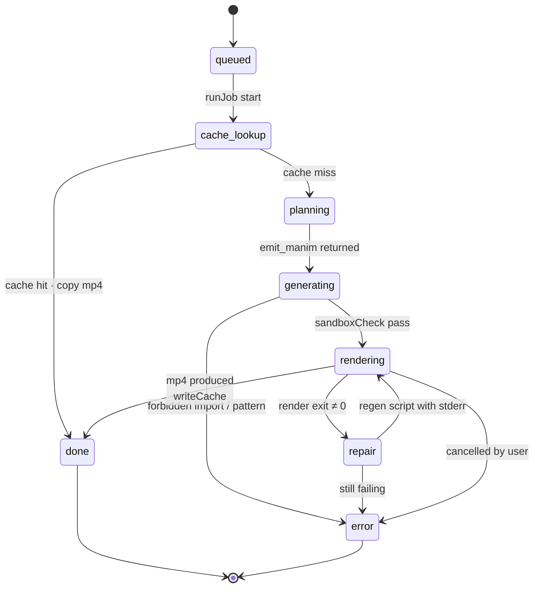

# Architecture

## High-level shape



## Agents

The orchestrator (`server/agents.ts`) runs each `/api/explain` request through a sequence of named agents. Each step emits an `agent_step` SSE event so the UI can render the pipeline live.

| Agent | Model | Role | Skipped when |
|-------|-------|------|--------------|
| **Router** | Haiku 4.5 | Pick lesson type (`text` / `visual_html` / `video_manim`) and write a one-sentence intent. | `force` parameter set |
| **Retriever** | local BM25 | Top-K chunks from the chunked PDF index built at upload. Zero LLM cost, ~10ms. | No `docId` (no PDF indexed) |
| **Planner** | Sonnet 4.6 | Decompose the concept into 3–5 ordered teaching beats with concrete viz ideas. Lists prerequisites the lesson assumes. For `video_manim`, also writes a Manim brief. | never |
| **Author** | Sonnet 4.6 (streaming) | Write the body HTML/CSS/JS following the plan. `partial` events stream HTML+CSS as they arrive (JS held back until complete). | `video_manim` mode (handed off to manim pipeline) |
| **Critic** | Haiku 4.5 | Review the authored lesson against the plan. Returns severity + concrete issues + a one-line praise. | `text` mode (nothing dynamic to verify) |
| **Refiner** | Sonnet 4.6 | Apply the Critic's fixes. Also runs as a deterministic JS-syntax fixer if the Author's JS doesn't parse. | Critic passes with `severity: "none"` |

**Pattern lineage:** the orchestration is a direct application of [ReAct](https://arxiv.org/abs/2210.03629) (separate reasoning agents acting in sequence) and [Reflexion](https://arxiv.org/abs/2303.11366) (self-critique → revise loop). Forced tool-use on every step keeps the schema deterministic.

**Cross-lesson memory.** The frontend sends the last 5 lesson titles + source snippets with each request. The Router and Planner see what's already been explored, so subsequent lessons can build on or reference prior ones rather than redefining concepts.

## Data model

The graph is a DAG of frames. Definitions in `src/types/index.ts`.

### `FrameData`

| Field | Type | Notes |
|-------|------|-------|
| `id` | string (UUID) | |
| `type` | `'root' \| 'child' \| 'quiz' \| 'remediation' \| 'summary' \| 'video'` | |
| `title` | string | ≤ 60 chars |
| `summary` | string | ≤ 140 chars |
| `content` | `FrameContent?` | HTML lesson body OR video URL + metadata |
| `sourceText` | string? | the highlighted text that produced this frame |
| `parentIds` / `childIds` | string[] | DAG edges |
| `loading` | boolean? | global loading flag |
| `mode` | `'text' \| 'visual_html' \| 'video_manim'?` | filled when known |
| `videoJobId` | string? | for video frames |
| `videoStage` | `'queued' \| 'planning' \| 'generating' \| 'rendering' \| 'done' \| 'error'?` | |
| `videoProgress` | number? | 0–100 |
| `videoMessage` | string? | human-readable stage |
| `videoEtaSec` | number? | streaming ETA during render |
| `videoError` | string? | filled on error |
| `prerequisites` | `{title: string; brief: string}[]?` | adaptive prereq chips |

### `FrameContent`

```ts
interface FrameContent {
  html?: string;             // body HTML, no <html>/<head>/<body>
  css?: string;              // styles only
  js?: string;               // vanilla JS, no <script> tags
  videoUrl?: string;         // /videos/<jobId>.mp4
  videoDurationSec?: number;
  videoChapters?: { t: number; label: string }[];
}
```

## State management

[Zustand](https://zustand-demo.pmnd.rs/) with the `persist` middleware.

- **`useGraphStore`** (`src/store/graphStore.ts`) — nodes, edges, focused id, CRUD on frames. Persisted to `localStorage` under key `ai-tutor-graph`.
- **`useDocumentStore`** (`src/store/documentStore.ts`) — current PDF, document summary, persisted PDF highlights. The `highlights` slice is persisted to `localStorage` under `ai-tutor-document`. The PDF file itself is not persisted.

## Request flow: highlight → multi-agent pipeline



Key points:
1. **Three SSE event types**: `agent_step` for pipeline visibility, `partial` for streaming content, `complete` for the final lesson.
2. **`/api/explain` is always SSE** — cache hits also use the protocol; they just emit a single `complete` event.
3. **`partial` events skip the `js` field** until the Author finishes. Half-written scripts can't be safely executed in the iframe.
4. **Forced tool-use everywhere.** Router, Planner, Author, Critic, Refiner all use forced `tool_choice` so the JSON shape is guaranteed.
5. **Cross-lesson memory** is passed as `recentLessons[]` from the client. Router and Planner condition on it.
6. **Selection capture** also stores PDF page-local rects so highlights persist as colored overlays on subsequent loads.

## Request flow: video pipeline



Stage progress percentages stream over SSE: `queued` (0) → `planning` (5) → `generating` (25) → `rendering` (40, with `etaSec` ticking every 2s) → `done` (100).

1. `createVideoJob` returns a jobId immediately. `runJob` runs detached in the background.
2. Cache lookup keys on SHA256 of `(text, brief, docSummary, parentTitle, model)`. Hit → copy `server/cache/videos/<key>.mp4` to `public/videos/<jobId>.mp4`, emit `done`, exit.
3. Stage `planning` — Claude tool call `emit_manim` produces `{python, duration_estimate, chapters}`. The system prompt is grounded in the local Manim docs mirror and includes few-shot scenes with `VoiceoverScene` + `GTTSService`.
4. Stage `generating` — `sandboxCheck()` rejects the script if it contains a forbidden pattern or imports outside the whitelist.
5. Stage `rendering` — try the warm Python worker first (`manim_worker.py`), fall back to `manim` CLI subprocess if worker is dead/disabled. The render uses `tempconfig` for isolation between jobs.
6. On render failure, one **self-repair** pass: feed stderr (last 2000 chars) back to Claude with the previous script, get a corrected script, re-render. If still failing, mark `error`.
7. On success, copy mp4 to both `public/videos/<jobId>.mp4` (served URL) and `server/cache/videos/<cacheKey>.mp4` (for future cache hits). Persist metadata to `server/cache/<cacheKey>.json`.
8. The user can `DELETE /api/video/:jobId` at any non-terminal stage. Cancel SIGTERMs the subprocess, marks `error`, and emits an `error` event.

The job map (`Map<string, VideoJob>` in `server/video.ts`) holds subscribers (response objects) and the live `child` reference. On terminal state, subscribers are flushed and the entry is deleted after a 60s grace period so late SSE connections still see the final state.

### Sandbox forbidden patterns

| Category | Patterns rejected |
|----------|-------------------|
| Module imports | `os`, `sys`, `subprocess`, `socket`, `requests`, `urllib`, `shutil`, `pathlib` |
| Dynamic loading | `__import__(...)`, `open(...)`, `exec(...)`, `eval(...)`, `compile(...)` |
| Scope walking | `globals()`, `locals()`, `getattr(_, '__...')` |
| Whitelist (only these top-level imports allowed) | `manim`, `numpy`, `math`, `manim_voiceover` |

## Iframe sandboxing

Lessons render in `<iframe srcdoc sandbox>`. The shell (`src/lib/lessonShell.ts`) injects:

- Dark base CSS (background, typography, code styles, button helpers)
- D3 v7, KaTeX 0.16 + auto-render, p5 v1.10 from CDN (only in focus-mode iframes; canvas previews skip the libs to keep small cards cheap)
- A `postMessage` bridge that forwards selections **and** runtime errors back to the parent

The `sandbox` attribute is `allow-scripts allow-popups allow-popups-to-escape-sandbox` — deliberately **without** `allow-same-origin`. That gives every lesson a unique opaque origin, so even malicious model output can't reach this app's `localStorage`, cookies, or IndexedDB.

`buildLessonHtml(content, {rich, bridge})` produces the final document. `rich: false` is used for canvas-card previews; `bridge: false` disables the postMessage bridge (also for previews).

## File map

```mermaid
flowchart TB
    subgraph S["server/"]
        idx["index.ts<br/>routes · SSE · cache check"]
        anth["anthropic.ts<br/>SDK + model defaults"]
        prompts["lessonPrompts.ts<br/>system prompts + tool schemas"]
        vid["video.ts<br/>job queue · sandboxCheck · self-repair"]
        cache["cache.ts<br/>SHA256 cache read/write"]
        worker_ts["manimWorker.ts<br/>warm Python worker client"]
        worker_py["manim_worker.py<br/>render in pre-imported Python"]
    end

    subgraph A["src/agent/"]
        tutor["tutor.ts<br/>fetch + EventSource + SSE parser"]
    end

    subgraph L["src/lib/"]
        flow["lessonFlow.ts<br/>orchestration"]
        shell["lessonShell.ts<br/>iframe builder"]
        layout["layout.ts<br/>dagre"]
    end

    subgraph St["src/store/"]
        graph["graphStore.ts<br/>nodes · edges · focus<br/>(persisted)"]
        doc["documentStore.ts<br/>doc · summary · highlights<br/>(highlights persisted)"]
    end

    subgraph C["src/components/"]
        pdf_view["PdfViewer/PdfViewer.tsx"]
        sel_hook["PdfViewer/useTextSelection.ts"]
        sel_pop["PdfViewer/SelectionPopover.tsx"]
        hl_overlay["PdfViewer/HighlightOverlays.tsx"]
        canvas["Canvas/Canvas.tsx<br/>(ReactFlow)"]
        node["Frame/FrameNode.tsx<br/>(card preview)"]
        panel["Frame/FramePanel.tsx<br/>(focus mode)"]
        vid_pl["Frame/VideoFramePlayer.tsx"]
    end

    idx --> anth
    idx --> prompts
    idx --> vid
    idx --> cache
    vid --> prompts
    vid --> cache
    vid --> worker_ts
    worker_ts --> worker_py

    flow --> tutor
    flow --> graph
    pdf_view --> sel_hook
    pdf_view --> sel_pop
    pdf_view --> hl_overlay
    pdf_view --> flow
    pdf_view --> doc
    canvas --> node
    panel --> flow
    panel --> vid_pl
    panel --> shell
    node --> shell
    hl_overlay --> doc
    hl_overlay --> graph
```

## Choices worth knowing

**Why an in-memory job map?** Single-process server, single user expected on localhost. No Redis, no DB, no overhead. If you ever multi-process this, swap the `Map` for a shared store.

**Why SSE over WebSockets?** SSE is one-way, server-pushed, auto-reconnects, plays nicely with HTTP/2 and proxies. Vite's dev proxy passes it through without config. WebSockets would be overkill — we don't need bidirectional comms during a render.

**Why iframe with `srcdoc` instead of shadow DOM?** The lesson JS is unsanitized model output. Iframes give us a real origin boundary, isolated globals, and a separate event loop. The `postMessage` bridge for selection is explicit and inspectable.

**Why force a tool call for explain?** Free-form JSON output drifts on shape. `tool_choice: {type: 'tool', name: 'emit_lesson'}` makes the model commit to the schema. Same trick on the Manim path with `emit_manim`.

**Why prompt caching?** The system prompts (especially the Manim one with three full few-shot scenes) are large. `cache_control: {type: 'ephemeral'}` on the system block means the second `/api/explain` call within 5 minutes reuses the cache and runs cheaper + faster.

**Why low quality for Manim?** `-q l` = 854×480 @ 15 FPS. Demo speed beats demo crispness — typical render is 20–40s. Bump to `-q m` (1280×720 @ 30 FPS) in `server/video.ts` if your audience needs HD.
