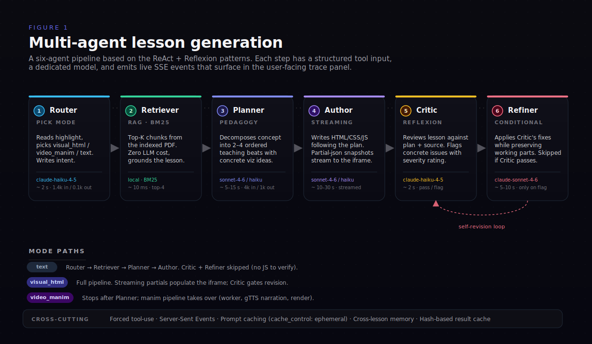
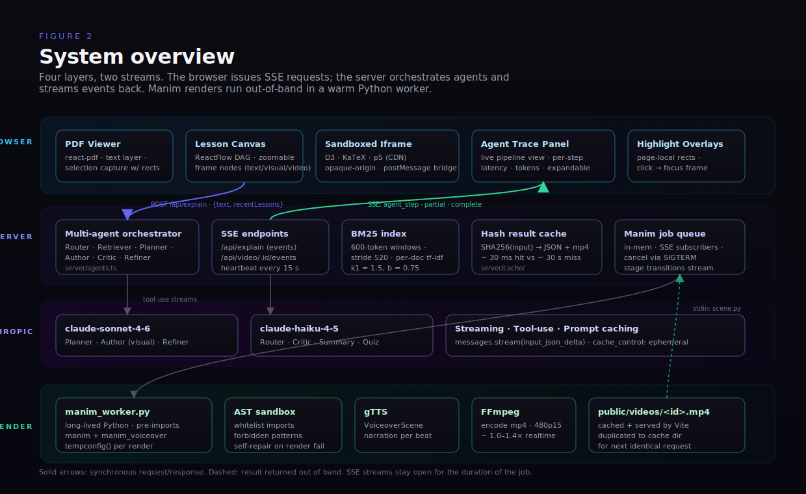
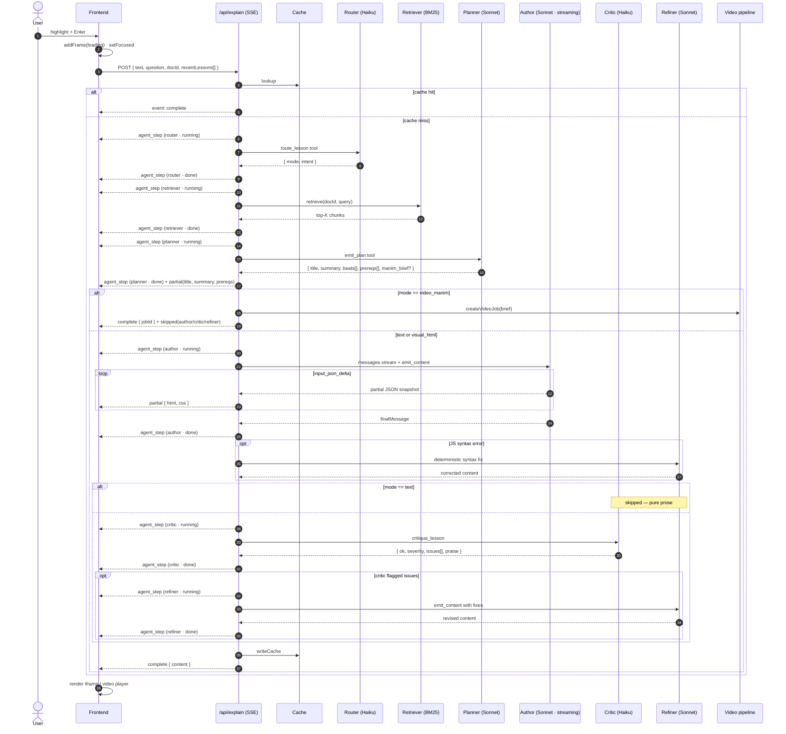
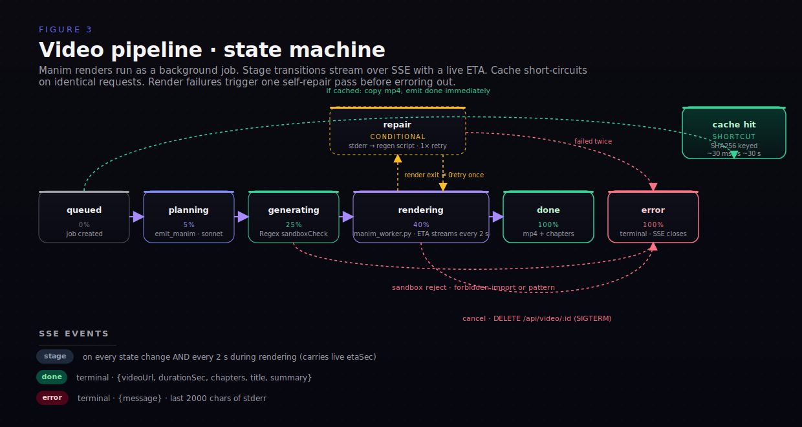

# Architecture



> **Figure 1.** A six-agent pipeline for generating an interactive lesson from a single user highlight. Each agent has a structured tool input, a dedicated model, and emits live Server-Sent Events that surface in the trace panel inside the app. Self-revision (Refiner ↻ Critic) runs only when the Critic flags a concrete issue. Mode-specific paths short-circuit unused steps — `text` mode skips Critic and Refiner; `video_manim` hands off to the Manim render pipeline after Planner.



> **Figure 2.** Layered runtime view. The Browser issues a single SSE request and consumes three event types in return (`agent_step`, `partial`, `complete`). The Server hosts the agent orchestrator, a per-document BM25 index, a hash-keyed result cache, and an in-memory job queue for long-running renders. Anthropic's Messages API is used in two flavors — Sonnet 4.6 for reasoning-heavy steps (Planner, visual Author, Refiner), Haiku 4.5 for the lightweight ones (Router, Critic, Summary, Quiz). Manim renders happen out of band in a long-lived Python worker that pre-imports `manim` and `manim_voiceover` at boot to skip the cold-start cost.

## Agents

The orchestrator (`server/agents.ts`) runs each `/api/explain` request through a sequence of named agents. Each step emits an `agent_step` SSE event so the UI can render the pipeline live.

| Agent | Model | Role | Skipped when |
|-------|-------|------|--------------|
| **Memory** | MiniLM-L6-v2 (local) | Embeds the current query (~50ms after warmup) and checks two reuse paths in parallel: (1) **frame redirect** — does the query semantically match an existing lesson on the canvas (cosine ≥ `MEMORY_REDIRECT_THRESHOLD`, default 0.78)? If so, focus that frame instead of generating. (2) **Semantic cache** — does the query match any prior cached generation (cosine ≥ `MEMORY_SEMANTIC_THRESHOLD`, default 0.82)? If so, reuse the cached content. | `LESSON_CACHE=off` |
| **Router** | Haiku 4.5 | Pick lesson type (`text` / `visual_html` / `video_manim`) and write a one-sentence intent. | `force` parameter set, OR Memory hit short-circuited the pipeline |
| **Retriever** | local BM25 | Top-K chunks from the chunked PDF index built at upload. Zero LLM cost, ~10ms. | No `docId` (no PDF indexed) |
| **Planner** | Sonnet 4.6 (Haiku for `text` mode) | Decompose the concept into 2–4 ordered teaching beats with concrete viz ideas. Lists prerequisites the lesson assumes. For `video_manim`, also writes a Manim brief. | never |
| **Author** | Sonnet 4.6 (streaming, Haiku for `text` mode) | Write the body HTML/CSS/JS following the plan. `partial` events stream HTML+CSS as they arrive (JS held back until complete). | `video_manim` mode (handed off to manim pipeline) |
| **Critic** | Haiku 4.5 | Review the authored lesson against the plan. Returns severity + concrete issues + a one-line praise. | `text` mode (nothing dynamic to verify) |
| **Refiner** | Sonnet 4.6 | Apply the Critic's fixes. Also runs as a deterministic JS-syntax fixer if the Author's JS doesn't parse. | Critic passes with `severity: "none"` |

**Pattern lineage:** the orchestration is a direct application of [ReAct](https://arxiv.org/abs/2210.03629) (separate reasoning agents acting in sequence) and [Reflexion](https://arxiv.org/abs/2303.11366) (self-critique → revise loop), with a vector-similarity short-circuit gate up front. Forced tool-use on every LLM step keeps the schema deterministic.

**Cross-lesson memory.** The frontend sends the last 8 lesson `id`s + titles + source snippets with each request. The Memory agent uses them for the redirect check; the Router and Planner see them as context so subsequent lessons can build on or reference prior ones rather than redefining concepts.

### Memory agent: how the math works

Embeddings are produced by `Xenova/all-MiniLM-L6-v2` (sentence-BERT, 384-dim, L2-normalised) running locally in node via `@xenova/transformers`. The model is quantised to ~30MB and pre-warmed at server boot, so per-request embedding cost is single-digit milliseconds.

Cosine similarity reduces to a dot product on normalised vectors:

```
sim(q, c) = Σᵢ q[i] · c[i]
```

For each `/api/explain`:

1. Compute `e = embed(text + question)`.
2. **Frame redirect** — embed each `recentLessons[i].title + sourceText` (also single-digit ms each), take `max_i sim(e, eᵢ)`. If above `MEMORY_REDIRECT_THRESHOLD`, emit a `complete` event with `mode: "redirect"` carrying the matched frame id. Frontend tears down its placeholder and focuses the existing frame.
3. **Semantic cache** — linear scan over `server/cache/semantic-index.json` (a flat JSON array of `{cacheKey, query, embedding[384]}`), compute `sim(e, entry.embedding)` for each. If `max sim ≥ MEMORY_SEMANTIC_THRESHOLD`, load `cacheKey` from disk and return its content. Marked as `semanticHit: {matchedQuery, score}` in the `complete` event so the UI can surface it.
4. Either way, `e` is preserved and inserted into the semantic index after the lesson completes — so the very next paraphrase becomes a hit.

**Empirical thresholds.** With MiniLM-L6-v2:

| Pair | Cosine | Note |
|------|-------:|------|
| "gradient descent optimizes by stepping downhill on the loss surface" ↔ "Gradient descent walks downhill on the loss landscape" | 0.87 | tight paraphrase, hits at 0.82 |
| "Recurrent Neural Networks process sequences" ↔ "RNNs and how they work" | ~0.74 | abbreviation + question form, doesn't hit at 0.82 |
| "softmax" ↔ "logits to probabilities" | ~0.55 | concept-related but not paraphrase |

If you want more aggressive reuse, drop `MEMORY_SEMANTIC_THRESHOLD` to ~0.75. The current default favours precision over recall — a false-positive cache hit shows the wrong content, which is much worse than missing a hit.

## Data model

The graph is a DAG of frames. Definitions in `src/types/index.ts`.

### `FrameData`

| Field | Type | Notes |
|-------|------|-------|
| `id` | string (UUID) | |
| `type` | `'root' \| 'child' \| 'quiz' \| 'remediation' \| 'summary' \| 'video'` | |
| `title` | string | ≤ 60 chars |
| `summary` | string | ≤ 140 chars |
| `content` | `FrameContent?` | HTML lesson body OR video URL + metadata |
| `sourceText` | string? | the highlighted text that produced this frame |
| `parentIds` / `childIds` | string[] | DAG edges |
| `loading` | boolean? | global loading flag |
| `mode` | `'text' \| 'visual_html' \| 'video_manim'?` | filled when known |
| `videoJobId` | string? | for video frames |
| `videoStage` | `'queued' \| 'planning' \| 'generating' \| 'rendering' \| 'done' \| 'error'?` | |
| `videoProgress` | number? | 0–100 |
| `videoMessage` | string? | human-readable stage |
| `videoEtaSec` | number? | streaming ETA during render |
| `videoError` | string? | filled on error |
| `prerequisites` | `{title: string; brief: string}[]?` | adaptive prereq chips |

### `FrameContent`

```ts
interface FrameContent {
  html?: string;             // body HTML, no <html>/<head>/<body>
  css?: string;              // styles only
  js?: string;               // vanilla JS, no <script> tags
  videoUrl?: string;         // /videos/<jobId>.mp4
  videoDurationSec?: number;
  videoChapters?: { t: number; label: string }[];
}
```

## State management

[Zustand](https://zustand-demo.pmnd.rs/) with the `persist` middleware.

- **`useGraphStore`** (`src/store/graphStore.ts`) — nodes, edges, focused id, CRUD on frames. Persisted to `localStorage` under key `ai-tutor-graph`.
- **`useDocumentStore`** (`src/store/documentStore.ts`) — current PDF, document summary, persisted PDF highlights. The `highlights` slice is persisted to `localStorage` under `ai-tutor-document`. The PDF file itself is not persisted.

## Request flow: highlight → multi-agent pipeline



Key points:
1. **Three SSE event types**: `agent_step` for pipeline visibility, `partial` for streaming content, `complete` for the final lesson.
2. **`/api/explain` is always SSE** — cache hits also use the protocol; they just emit a single `complete` event.
3. **`partial` events skip the `js` field** until the Author finishes. Half-written scripts can't be safely executed in the iframe.
4. **Forced tool-use everywhere.** Router, Planner, Author, Critic, Refiner all use forced `tool_choice` so the JSON shape is guaranteed.
5. **Cross-lesson memory** is passed as `recentLessons[]` from the client. Router and Planner condition on it.
6. **Selection capture** also stores PDF page-local rects so highlights persist as colored overlays on subsequent loads.

## Request flow: video pipeline



> **Figure 3.** Stage transitions for a Manim video job. The pipeline forks on cache hit (~30 ms shortcut from `queued` straight to `done`) and on render failure (one self-repair pass before `error`). Stage events stream every 2 s during rendering with a live `etaSec` so the user can see remaining time. Three terminal events: `done`, `error`, or cancelled (`error` with message `"Cancelled by user"`).

1. `createVideoJob` returns a jobId immediately. `runJob` runs detached in the background.
2. Cache lookup keys on SHA256 of `(text, brief, docSummary, parentTitle, model)`. Hit → copy `server/cache/videos/<key>.mp4` to `public/videos/<jobId>.mp4`, emit `done`, exit.
3. Stage `planning` — Claude tool call `emit_manim` produces `{python, duration_estimate, chapters}`. The system prompt is grounded in the local Manim docs mirror and includes few-shot scenes with `VoiceoverScene` + `GTTSService`.
4. Stage `generating` — `sandboxCheck()` rejects the script if it contains a forbidden pattern or imports outside the whitelist.
5. Stage `rendering` — try the warm Python worker first (`manim_worker.py`), fall back to `manim` CLI subprocess if worker is dead/disabled. The render uses `tempconfig` for isolation between jobs.
6. On render failure, one **self-repair** pass: feed stderr (last 2000 chars) back to Claude with the previous script, get a corrected script, re-render. If still failing, mark `error`.
7. On success, copy mp4 to both `public/videos/<jobId>.mp4` (served URL) and `server/cache/videos/<cacheKey>.mp4` (for future cache hits). Persist metadata to `server/cache/<cacheKey>.json`.
8. The user can `DELETE /api/video/:jobId` at any non-terminal stage. Cancel SIGTERMs the subprocess, marks `error`, and emits an `error` event.

The job map (`Map<string, VideoJob>` in `server/video.ts`) holds subscribers (response objects) and the live `child` reference. On terminal state, subscribers are flushed and the entry is deleted after a 60s grace period so late SSE connections still see the final state.

### Sandbox forbidden patterns

| Category | Patterns rejected |
|----------|-------------------|
| Module imports | `os`, `sys`, `subprocess`, `socket`, `requests`, `urllib`, `shutil`, `pathlib` |
| Dynamic loading | `__import__(...)`, `open(...)`, `exec(...)`, `eval(...)`, `compile(...)` |
| Scope walking | `globals()`, `locals()`, `getattr(_, '__...')` |
| Whitelist (only these top-level imports allowed) | `manim`, `numpy`, `math`, `manim_voiceover` |

## Iframe sandboxing

Lessons render in `<iframe srcdoc sandbox>`. The shell (`src/lib/lessonShell.ts`) injects:

- Dark base CSS (background, typography, code styles, button helpers)
- D3 v7, KaTeX 0.16 + auto-render, p5 v1.10 from CDN (only in focus-mode iframes; canvas previews skip the libs to keep small cards cheap)
- A `postMessage` bridge that forwards selections **and** runtime errors back to the parent

The `sandbox` attribute is `allow-scripts allow-popups allow-popups-to-escape-sandbox` — deliberately **without** `allow-same-origin`. That gives every lesson a unique opaque origin, so even malicious model output can't reach this app's `localStorage`, cookies, or IndexedDB.

`buildLessonHtml(content, {rich, bridge})` produces the final document. `rich: false` is used for canvas-card previews; `bridge: false` disables the postMessage bridge (also for previews).

## File map

```
server/
├── index.ts          ── routes · SSE response · cache short-circuit
├── anthropic.ts      ── SDK client · MAIN_MODEL / FAST_MODEL / SUMMARY_MODEL
├── lessonPrompts.ts  ── QUIZ + SUMMARY + MANIM system prompts and tools
├── agents.ts         ── orchestrator + Router · Retriever · Planner · Author · Critic · Refiner
├── retriever.ts      ── BM25 index (tokenize · build · score · top-K)
├── cache.ts          ── SHA256 cache read/write (per-mode keys)
├── video.ts          ── job queue · sandboxCheck · self-repair · SSE subscribe
├── manimWorker.ts    ── TS-side client of the long-lived Python worker
└── manim_worker.py   ── pre-imports manim + manim_voiceover, renders on stdin

src/
├── agent/
│   └── tutor.ts                  ── fetch + ReadableStream SSE parser · EventSource
├── lib/
│   ├── lessonFlow.ts             ── startLesson · attachVideoSubscription
│   ├── lessonShell.ts            ── iframe HTML builder · CDN libs · runtime error bridge
│   └── layout.ts                 ── dagre auto-layout
├── store/
│   ├── graphStore.ts             ── nodes · edges · focused id (persisted)
│   └── documentStore.ts          ── doc · summary · docId · highlights (highlights persisted)
└── components/
    ├── PdfViewer/
    │   ├── PdfViewer.tsx         ── react-pdf wrapper · summarize on load
    │   ├── useTextSelection.ts   ── window.getSelection + page-local rects
    │   ├── SelectionPopover.tsx  ── Explain / Animate (⌘+Enter)
    │   └── HighlightOverlays.tsx ── persisted colored regions over the text layer
    ├── Canvas/
    │   └── Canvas.tsx            ── ReactFlow graph · auto-layout button
    └── Frame/
        ├── FrameNode.tsx         ── canvas card preview
        ├── FramePanel.tsx        ── fullscreen focus mode (Lesson / Pipeline tabs)
        ├── AgentTracePanel.tsx   ── live agent trace UI
        └── VideoFramePlayer.tsx  ── progress + ETA + chapter buttons
```

Key dependencies (one-line summary): `index.ts` calls into `agents.ts` and `video.ts`; `agents.ts` consumes `retriever.ts` + `cache.ts` + `lessonPrompts.ts`. On the client, `lessonFlow.ts` is the only module that touches both `tutor.ts` and the stores; components import from `lessonFlow.ts` and the stores, never from `tutor.ts` directly.

## Choices worth knowing

**Why an in-memory job map?** Single-process server, single user expected on localhost. No Redis, no DB, no overhead. If you ever multi-process this, swap the `Map` for a shared store.

**Why SSE over WebSockets?** SSE is one-way, server-pushed, auto-reconnects, plays nicely with HTTP/2 and proxies. Vite's dev proxy passes it through without config. WebSockets would be overkill — we don't need bidirectional comms during a render.

**Why iframe with `srcdoc` instead of shadow DOM?** The lesson JS is unsanitized model output. Iframes give us a real origin boundary, isolated globals, and a separate event loop. The `postMessage` bridge for selection is explicit and inspectable.

**Why force a tool call for explain?** Free-form JSON output drifts on shape. `tool_choice: {type: 'tool', name: 'emit_lesson'}` makes the model commit to the schema. Same trick on the Manim path with `emit_manim`.

**Why prompt caching?** The system prompts (especially the Manim one with three full few-shot scenes) are large. `cache_control: {type: 'ephemeral'}` on the system block means the second `/api/explain` call within 5 minutes reuses the cache and runs cheaper + faster.

**Why low quality for Manim?** `-q l` = 854×480 @ 15 FPS. Demo speed beats demo crispness — typical render is 20–40s. Bump to `-q m` (1280×720 @ 30 FPS) in `server/video.ts` if your audience needs HD.
