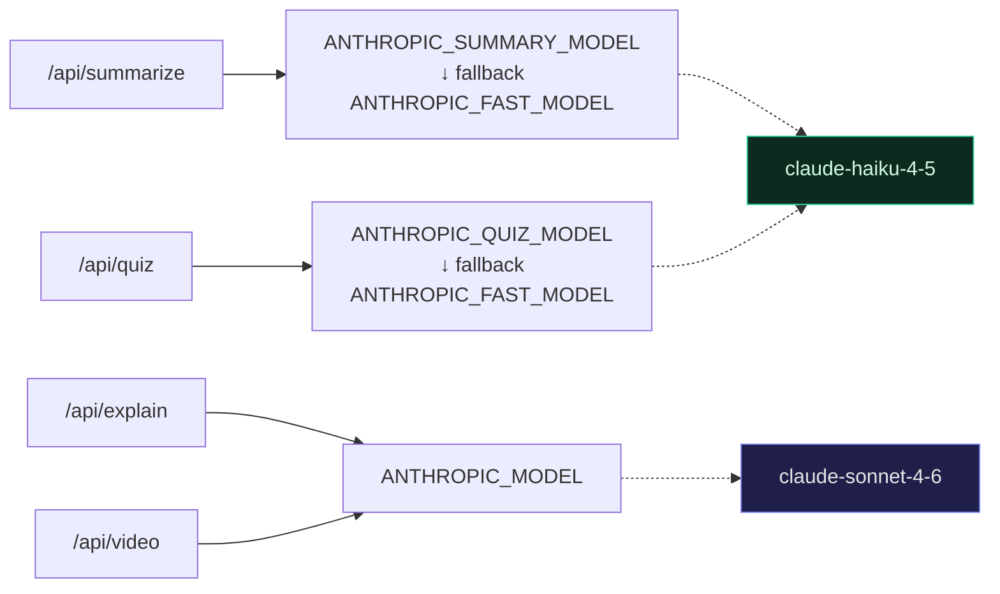

# Extending and customizing

How to add features, swap parts, and tune the system.

## Model routing

Four env vars in `.env`:

```env
ANTHROPIC_MODEL=claude-sonnet-4-6        # explain (visual_html, manim_brief)
ANTHROPIC_FAST_MODEL=claude-haiku-4-5    # default for cheap paths
ANTHROPIC_SUMMARY_MODEL=                 # falls back to FAST_MODEL
ANTHROPIC_QUIZ_MODEL=                    # falls back to FAST_MODEL
```



The summary task is large input (a whole document), small output (~200 words) — Haiku handles it well. Quizzes are templatey and benefit from Haiku's speed. Sonnet is reserved for HTML/CSS/JS authoring and Manim Python generation where reasoning matters.

## Memory agent thresholds

Two cosine-similarity thresholds gate the semantic dedup paths:

```env
# Frame redirect — minimum cosine similarity between a new highlight and
# an existing on-canvas frame for the system to skip generation and just
# focus the existing frame. Higher = stricter (fewer false redirects).
MEMORY_REDIRECT_THRESHOLD=0.78

# Semantic cache hit — minimum cosine similarity for a new query to
# reuse a prior cached generation. Higher = stricter.
MEMORY_SEMANTIC_THRESHOLD=0.82
```

To tune: temporarily log the cosine score of every pair and run a few representative paraphrases through the system. The defaults (0.78 / 0.82) favor precision over recall — a wrong reuse is worse than a missed reuse. Drop to ~0.72 / 0.75 for more aggressive sharing.

The embedding model is `Xenova/all-MiniLM-L6-v2` (384-dim, quantized ~30MB, runs locally). Swap it in `server/embeddings.ts` if you want a bigger model — `BAAI/bge-small-en-v1.5` is a popular upgrade with better English retrieval at the same dimension.

## Add a new agent to the pipeline

All agents live in `server/agents.ts`. Each follows the same shape: takes orchestrator input + previous agents' output, calls Anthropic with a forced tool, emits trace events, returns its structured output.

To add a new agent (e.g. a `Verifier` that fact-checks the lesson against retrieved chunks):

1. **Define the tool schema** at the top of `server/agents.ts`:
   ```ts
   const VERIFIER_TOOL = {
     name: 'verify_lesson',
     input_schema: { /* … */ },
   };
   ```
2. **Define the system prompt** for the agent's role.
3. **Write the runner**: `runVerifier(plan, content, chunks, emit) → VerifierOutput`. Use `startTrace` / `finishTrace` helpers; emit on both running and done states.
4. **Add the agent name** to `AgentName` in `server/agents.ts` AND in `src/types/index.ts` (they're duplicated — keep them in sync).
5. **Add a frontend label** in `AGENT_META` inside `src/components/Frame/AgentTracePanel.tsx`.
6. **Wire it into the orchestrator** in `server/index.ts:/api/explain` between the existing steps.

The trace UI auto-renders any step regardless of agent name; you only need the metadata entry for the colored dot and label.

## Add a new lesson type

The Router decides the mode in `server/agents.ts:ROUTER_TOOL`.

1. **Extend the enum** in `ROUTER_TOOL.input_schema.properties.mode`. E.g. add `'audio_explainer'`.
2. **Document the new type** in `ROUTER_SYSTEM` with bias rules for when to pick it.
3. **Update the response handler** in `server/index.ts:/api/explain` to branch on the new mode.
4. **Update the type** `LessonMode` in `src/types/index.ts` AND the matching union in `server/agents.ts`.
5. **Render in the UI** — add a new component or branch in `FrameNode.tsx` and `FramePanel.tsx`. If it's async (like video), follow the SSE pattern in `server/video.ts` and `lessonFlow.attachVideoSubscription`.

## Customize the Manim system prompt

`server/lessonPrompts.ts:MANIM_SYSTEM` controls the Python that gets generated.

Common edits:

- **Allow more classes** — add a section listing `Surface`, `ThreeDAxes`, etc., and switch the `Scene` requirement to allow `ThreeDScene`.
- **Restrict to a whitelist** — list every class the model may use; reject all others in `sandboxCheck`.
- **Change the visual style** — edit the dark-theme block (background hex, accent colors, font sizes).
- **Add another few-shot** — paste another `class Lesson(Scene): …` example. The three current examples are gradient descent, eigenvector under linear transform, and softmax — pick examples covering the modalities you most want.

The local Manim mirror at `docs/manim/` is your source of truth for what's available. Search it for class names and method signatures while editing the prompt.

## Customize HTML lesson libraries

`src/lib/lessonShell.ts:RICH_LIBS` injects D3, KaTeX, and p5 by default. To add another lib (Three.js, Plotly, Mermaid, MathLive…), append a `<script>` or `<link>` tag.

Then mention the new library in `LESSON_SYSTEM` (`server/lessonPrompts.ts`) so Claude knows it's available — without that hint, the model won't use it.

Performance note: each library adds ~30–500KB to every iframe. Browsers cache the CDN URLs, so the cost is one-time per origin, but lazy-loading per lesson type would be a sensible optimization if you load many heavy libs.

## Customize the iframe styling

The base CSS in `lessonShell.ts` defines:

- Page background, body padding, max-width content column
- Heading sizes, link color, code block style
- `.btn-primary` and `.btn-ghost` reusable button classes
- `.card` wrapper for grouped content
- Selection highlight color

Lessons can override anything via the `css` field they emit. The base just provides reasonable defaults.

## Add a new API endpoint

Pattern in `server/index.ts`:

```ts
app.post('/api/your-endpoint', async (req, res) => {
  const { ...params } = req.body || {};
  try {
    const completion = await client.messages.create({
      model: MAIN_MODEL,
      system: [{ type: 'text', text: YOUR_PROMPT, cache_control: { type: 'ephemeral' } }],
      max_tokens: 8192,
      tools: [YOUR_TOOL],                              // for structured output
      tool_choice: { type: 'tool', name: 'your_tool' },
      messages: [{ role: 'user', content: userMsg }],
    });
    const tool = findToolUse<YourToolInput>(completion, 'your_tool');
    if (!tool) {
      res.status(500).json({ error: 'Model did not call your_tool' });
      return;
    }
    res.json({ /* shaped response */ });
  } catch (err) {
    res.status(500).json({ error: (err as Error).message });
  }
});
```

`cache_control: {type: 'ephemeral'}` on the system block enables prompt caching. With Sonnet 4.6, cached system prompts cost roughly 10% of normal input tokens on cache hits. Keep this on for any long, reused system prompt.

## Persist the graph elsewhere

By default, `useGraphStore` persists nodes + edges to `localStorage`. To swap in a backend store:

1. Replace `persist` middleware in `src/store/graphStore.ts` with custom subscribe + sync logic.
2. Add API endpoints `GET /api/graph` and `PUT /api/graph` (server-side persistence is up to you — Postgres, file, etc.).
3. On `addFrame`/`updateFrame`, debounce a save call.

Be aware that some FrameContent payloads are large (full HTML lessons). For multi-user storage, normalize: store concept metadata + a content blob keyed by id.

## Refresh the Manim docs mirror

The mirror at `docs/manim/` is gitignored (73MB, 555 pages). Re-create it any time:

```bash
rm -rf docs/manim
mkdir -p docs/manim
cd docs/manim
wget -e robots=off --mirror --no-parent --no-host-directories --cut-dirs=2 \
  --reject="*.css,*.js,*.png,*.jpg,*.svg,*.gif,*.woff*,*.ttf,*.ico,*.map,*.webp,*.mp4,*.webm,*.zip,*.inv" \
  --wait=0.1 --random-wait --tries=3 \
  --user-agent="Mozilla/5.0" \
  https://docs.manim.community/en/stable/
```

Takes ~2–4 minutes depending on network. Resulting tree:

- `docs/manim/index.html` — landing page
- `docs/manim/reference/` — every Mobject, Animation, Scene class (~386 pages)
- `docs/manim/tutorials/` — quickstart, building blocks
- `docs/manim/guides/` — deep dive, configuration, voiceovers
- `docs/manim/examples.html` — official example gallery (great for prompt few-shots)

Use this with `grep` while iterating on the Manim system prompt.

## Add a hardcoded canned-lesson layer

Strategy for high-stakes demos: intercept specific highlights and return pre-baked perfect lessons. Falls back to the live pipeline when no match.

Sketch:

1. `server/canned/manifest.json` — array of `{matchType: 'exact' | 'contains' | 'regex', pattern: string, lessonId: string}`
2. `server/canned/<lessonId>/` — pre-baked `meta.json`, `lesson.html`, `lesson.css`, `lesson.js`, optional `video.mp4` and `chapters.json`
3. In `/api/explain` and `/api/video`, check the manifest first. Match → return canned content immediately. Miss → proceed to Claude.
4. Add an `npm run bake-canned <id>` script that runs the live pipeline once and dumps the result into a canned folder, ready for hand-polish.

This is intentionally not implemented — see the project's hackathon strategy.

## Production deploy

This product was built for local single-user use. Hardening for prod:

- **Sandbox the Manim subprocess** in a container or `firejail`. The AST check is defense in depth, not a guarantee.
- **Authenticate the API**. Currently anyone with network access can hit `/api/explain` and burn your Anthropic credits.
- **Persist jobs**. The in-memory job map vanishes on restart. Move to Redis or a simple file-backed queue.
- **Rate-limit**. A user could spam `/api/video` and queue 100 renders.
- **Long-term mp4 storage**. `public/videos/` grows unboundedly. Add a TTL cleanup or move to object storage with signed URLs.
- **Multi-process**. Currently single-process; the SSE job map and the Manim subprocess both assume that. For multi-process, run the renderer as a worker pool with a shared Redis pubsub.
