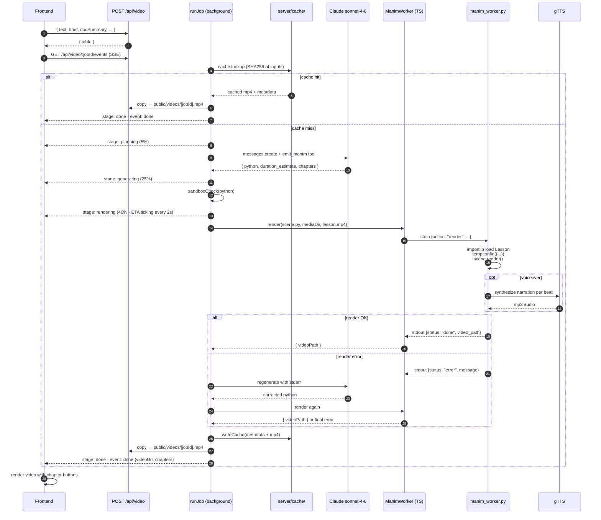
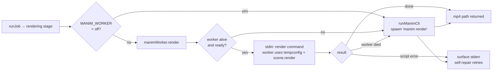

# Manim video pipeline

A deep dive into how `video_manim` lessons are produced. If you're debugging a render failure or extending the pipeline, this is the doc to read.

## Overview



Every artifact:

| Path | When it exists | Notes |
|------|---------------|-------|
| `server/tmp/<jobId>/scene.py` | during render | gitignored, deleted on completion |
| `server/tmp/<jobId>/media/...` | during render | Manim's media output dir |
| `server/cache/<key>.json` | after first success | metadata for future cache hits |
| `server/cache/videos/<key>.mp4` | after first success | cached mp4, copied on hit |
| `public/videos/<jobId>.mp4` | after success | gitignored, served by Vite (dev) or Express |

## The Manim system prompt

Lives in `server/lessonPrompts.ts` as `MANIM_SYSTEM`. Key constraints encoded:

1. **Class is `Lesson`**. Always. The render command targets that scene.
2. **Imports are restricted**. `from manim import *` plus optional `numpy as np` and `math`. Anything else triggers `sandboxCheck` rejection.
3. **No file IO, network, exec/eval**. Even though the sandbox check would catch them, the prompt tells Claude up front so it never tries.
4. **Duration 20–45s** (with narration), ending with `self.wait(1)`. Keeps videos short enough for a teaching beat.
5. **`Text` over `MathTex`**. LaTeX is fragile and slow. The prompt biases away from it.
6. **Dark style** — `self.camera.background_color = "#0a0a0d"`, indigo accents `#818cf8` / `#6366f1`. Keeps videos visually consistent with HTML lessons.
7. **`VoiceoverScene` + `GTTSService`** — every animation beat is wrapped in a `with self.voiceover(text="…") as t:` block, and animations use `run_time=t.duration` so visuals auto-pace to the narration.
8. **Two condensed few-shot examples** — gradient descent and softmax. Each shows the voiceover-wrapped beat structure.

## The Manim tool

Forced via `tool_choice: {type: 'tool', name: 'emit_manim'}`.

```ts
input_schema = {
  python: string,                              // full file source
  duration_estimate: number,                   // seconds, 15–35
  chapters: { t: number, label: string }[],    // 2–5, ascending
}
```

The chapters become clickable seek buttons in `VideoFramePlayer.tsx`.

## Sandbox check

`sandboxCheck()` in `server/video.ts` is a pre-render pass over the generated Python. It rejects:

| Pattern | Reason |
|---------|--------|
| Missing `from manim import *` | Required for the standard Manim namespace |
| Missing `class Lesson(...)` | Render target |
| `import os` / `from os` | Filesystem access |
| `import sys` | Interpreter introspection |
| `import subprocess` / `from subprocess` | Code execution |
| `import socket` / `from socket` | Network |
| `import requests`, `urllib` | Network |
| `import shutil`, `pathlib` | Filesystem manipulation |
| `__import__(...)` | Bypasses static import check |
| `open(...)` | File IO |
| `exec(...)`, `eval(...)`, `compile(...)` | Arbitrary code |
| `globals()`, `locals()` | Scope walking |
| `getattr(_, '__...')` | Dunder bypass |
| Any import other than `manim`, `numpy`, `math` | Whitelist |

This is **defense in depth**, not a security guarantee. Manim itself is a powerful Python library — a determined adversary can still break things via animation classes that take callable arguments. For a public-facing deployment, run the Manim subprocess in a container or `firejail`/`bubblewrap`. For a local-tutor product, the sandbox is enough to catch model mistakes, not malice.

## Render command

```
manim render \
  -q l \
  --media_dir <tmp>/media \
  --output_file lesson.mp4 \
  --disable_caching \
  <tmp>/scene.py \
  Lesson
```

| Flag | Why |
|------|-----|
| `-q l` | Low quality (854×480 @ 15 FPS) — fastest |
| `--media_dir` | Sandbox the output inside the per-job tmp dir |
| `--output_file lesson.mp4` | Predictable filename for the find step |
| `--disable_caching` | Avoids cross-job cache poisoning |

After completion, the server walks `<tmp>/media/` recursively to find any `*.mp4` and copies it to `public/videos/<jobId>.mp4`.

## Render path: warm worker → CLI fallback

The render step has two implementations behind a single `renderManim()` entry point:



The warm-worker path (`server/manim_worker.py`) imports `manim` and `manim_voiceover` once at boot, so subsequent renders skip the ~3–5 s import-time cost the CLI pays per invocation. If the worker dies for any reason (OOM, child segfault, `MANIM_WORKER=off`), `renderManim()` transparently falls back to the CLI subprocess.

## Self-repair

If `manim render` exits non-zero, the server:

1. Captures `stderr` (last 2000 chars)
2. Calls `repairManim()` — same `MANIM_SYSTEM`, but the user message includes the previous Python and the captured stderr, asking for a fix that preserves teaching intent
3. Re-runs sandbox check + render
4. If still failing, throws with the second stderr appended to the error message

This catches the common failure modes:

- `LaTeX Error: File not found` (e.g. unusual symbol used inside `MathTex`)
- `TypeError: ... unexpected keyword argument` (model used a v0.18 API on a v0.19 install)
- `IndexError` from out-of-bounds array indexing inside an `always_redraw` callback

The repair only runs **once**. If the model can't fix its own bug in a single shot, the failure surfaces — usually a sign the request itself is too ambitious for the model.

## SSE and clients

`server/video.ts:subscribe(jobId, res)` handles every subscriber:

- Sets SSE headers
- Immediately sends the latest known stage (so late subscribers don't wait for the next stage tick)
- If the job is already in `done` or `error`, sends the terminal event and closes the stream
- Otherwise pushes the response into `job.subscribers[]`, starts a 15s heartbeat, and removes itself on close

The client side (`subscribeVideo` in `src/agent/tutor.ts`) wraps `EventSource` with three handlers: `onStage`, `onDone`, `onError`. The returned function closes the connection.

## Tuning

### Render quality / speed

Default `-q l` typically renders 25s of animation in 20–40s on a modern CPU. To trade speed for crispness:

- `-q l` — 854×480 @ 15 FPS (default)
- `-q m` — 1280×720 @ 30 FPS
- `-q h` — 1920×1080 @ 60 FPS
- `-q p` — 2560×1440 @ 60 FPS

Edit the args array in `renderManim()` in `server/video.ts`.

### Duration and pacing

The system prompt says 15–35 seconds. To allow longer videos, edit `MANIM_SYSTEM` in `server/lessonPrompts.ts`. Note: rendering scales linearly with duration. A 60s video at low quality takes ~60s to render.

### Allowed Mobjects / Animations

The prompt currently lists encouraged classes (`Create`, `Write`, `FadeIn`, `Transform`, `LaggedStart`, `ValueTracker`, `always_redraw`, etc.). To restrict further, add an explicit whitelist section. To expand (e.g. allow 3D scenes), add encouragement and update the `Scene` allowance in the prompt.

The local Manim docs mirror at `docs/manim/` is the source of truth for what's available in v0.19.

### Background color and accent palette

Edit the system prompt's design rules block. Currently:

- Background: `#0a0a0d`
- Accents: `#818cf8`, `#6366f1`
- Text: near-white

These match the rest of the app's dark palette in `src/index.css` and Tailwind config.

## Troubleshooting

| Symptom | Cause | Fix |
|---------|-------|-----|
| `Manim render failed twice` | model writing scenes that break repeatedly | usually triggered by very abstract/weird highlight text. Try a more concrete brief via the **Animate** button on a focused frame. |
| `LaTeX Error: File 'standalone.cls' not found` | LaTeX install missing pieces | `sudo apt install texlive-latex-extra` or instruct prompt to never use `MathTex` (already biased) |
| Render succeeds but no MP4 found | unusual `--output_file` interaction or `media_dir` permissions | check `server/tmp/<jobId>/media/` exists and contains `videos/scene/<resolution>/lesson.mp4` |
| SSE stream dies after ~30s | proxy idle timeout | the server already heartbeats every 15s; if behind a custom proxy, ensure no buffering and `X-Accel-Buffering: no` is forwarded |
| Frontend never gets the `done` event | EventSource closed too early or wrong URL | confirm via `curl -N http://127.0.0.1:8787/api/video/<jobId>/events` that events flow at the server |
| Sandbox check rejects valid script | regex too aggressive | inspect `FORBIDDEN_PATTERNS` in `server/video.ts`. The patterns are intentionally strict — a false positive is safer than a false negative. |
| Audio is missing | Manim doesn't add audio by default | for narrated videos, add a voiceover plugin pass downstream. Out of scope for this product. |

## Manual testing

End-to-end test from the shell:

```bash
# Start the server in one terminal
npx tsx server/index.ts

# In another terminal:
JOB=$(curl -s http://127.0.0.1:8787/api/video \
  -X POST -H 'Content-Type: application/json' \
  -d '{"text":"Pythagorean theorem","brief":"Right triangle with squares on each side showing a^2+b^2=c^2"}' \
  | jq -r .jobId)

# Stream progress
curl -N http://127.0.0.1:8787/api/video/$JOB/events

# Final mp4 lands here
ls -la public/videos/$JOB.mp4
```
