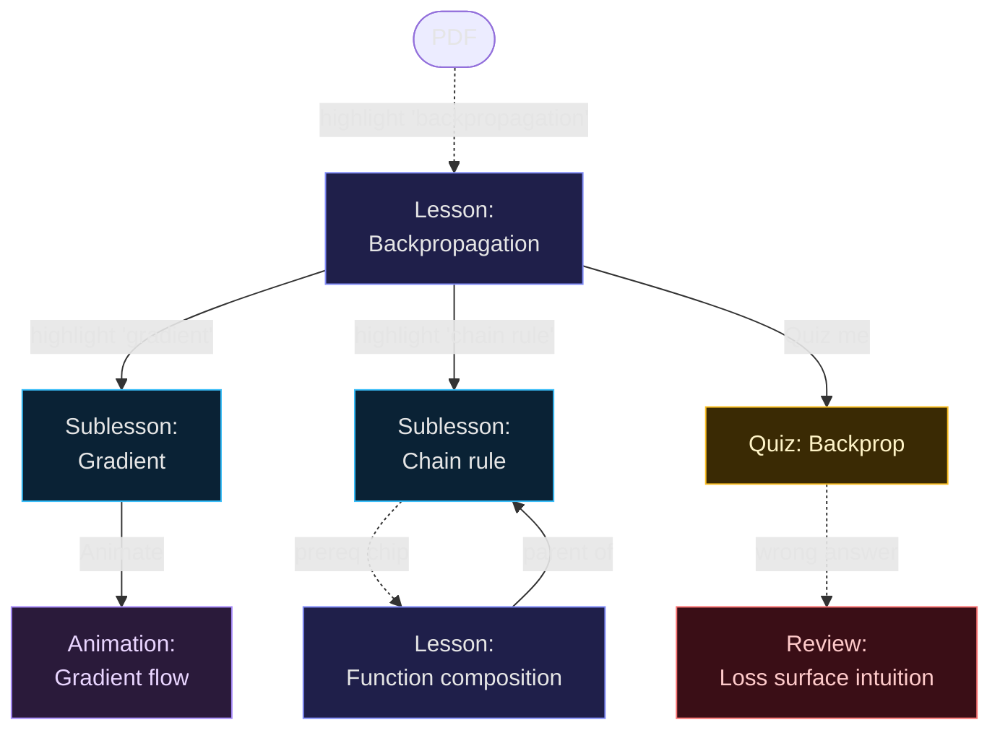
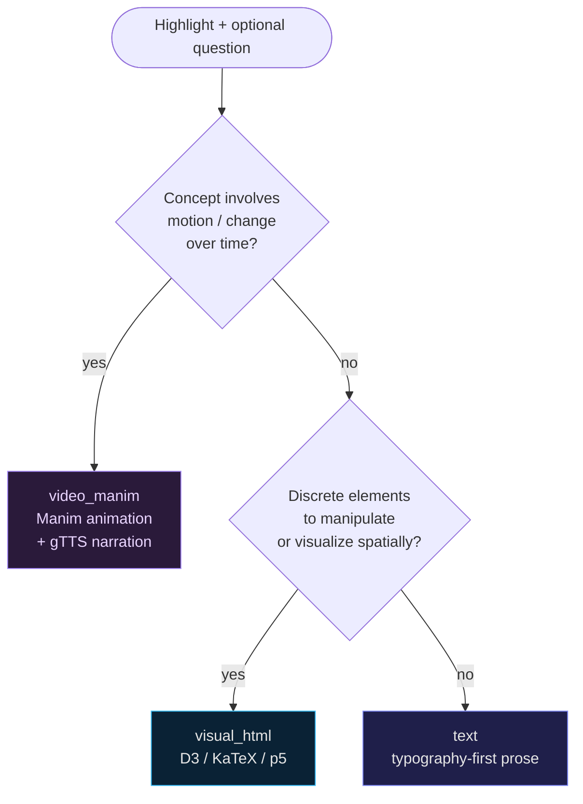

# Usage guide

This is the user-facing manual. Every feature, every interaction, every keyboard shortcut.

## How a learning graph grows

Every interaction in this app extends a directed graph of frames. Highlights spawn nodes; "deeper" highlights inside a lesson spawn child nodes; **Animate**, **Quiz me**, and prerequisite chips spawn typed sibling/parent nodes. Over a session, the canvas turns into a personalized map of how you came to understand the material.

## Layout

The app is a two-pane layout: PDF on the left, learning canvas on the right. Drag the divider to resize. Drag all the way left to hide the PDF; drag all the way right to hide the canvas.

The header shows a count of how many lessons you've created and a **Clear** button (with confirmation) that wipes the graph and the persisted PDF highlights. The graph and highlights are saved to `localStorage` so they survive reloads.

## The PDF pane (left)

### Uploading

Click **Upload PDF**. Local file only — the file never leaves your machine other than the text Claude needs to summarize and ground lessons.

### Indexing

As soon as the PDF loads, Claude reads up to the first 80,000 characters and produces a 150–250 word summary that captures the document's domain, audience, and key terms. This summary is sent with every lesson request so that "kernel" in a CS paper doesn't get confused with "kernel" in a chemistry paper.

A small badge in the top right shows status: **Indexing** (animated dot) → **Indexed** (green dot).

### Zooming

Use the `−` / `+` buttons at the top right to adjust PDF render scale (50% to 300%).

### Highlighting

Select any text. A popover appears just above the selection with:

- A preview of the highlighted text (truncated to 160 chars)
- A textarea where you can optionally type a question
- An **Explain** button (also: <kbd>Enter</kbd>)
- An **Animate** button (also: <kbd>⌘ Enter</kbd> on macOS or <kbd>Ctrl Enter</kbd> on Linux/Windows)

If you don't type a question, the placeholder reads "Ask anything, or press Enter to explain." The empty case is fine — Claude generates a thorough explanation appropriate to the highlighted text.

Press <kbd>Esc</kbd> to dismiss the popover. Click outside the popover to dismiss it.

## The canvas (right)

A zoomable, pannable infinite canvas of lesson nodes powered by ReactFlow.

### Node anatomy

Each node is a card with:

- Type badge (Lesson, Sublesson, Quiz, Review, Animation, Summary)
- Title (≤ 60 chars, generated by Claude)
- One-sentence summary
- Live preview rendered in a sandboxed iframe (when zoomed in past 35%)

For animation nodes, the preview is a muted looping video clip. While rendering, the preview shows a progress bar with the current stage.

### Canvas controls

- **Drag empty space** — pan
- **Scroll wheel** — zoom
- **`+` / `−` buttons** (bottom-left) — zoom in/out
- **Fit-view button** (bottom-left) — fit all nodes to viewport
- **Lock button** (bottom-left) — lock node positions
- **Auto-layout** (top-right) — re-runs the dagre layout to organize nodes hierarchically
- **Minimap** (bottom-right) — bird's-eye view, click to jump

### Click to focus

Click a node to enter **focus mode** — it opens fullscreen with full interactivity. Click the back arrow or press <kbd>Esc</kbd> to return to the canvas.

## Focus mode

The frame opens fullscreen. Top bar shows:

- **Back** (←) — return to canvas (also: <kbd>Esc</kbd>)
- **Parent** / **Child** arrows — navigate the graph without leaving focus mode (skips between connected lessons)
- Type label and full title
- **Animate** button — re-generate this concept as a video (only shown for non-video frames)
- **Quiz me** button — generate a quiz testing this concept

### Highlighting inside a lesson

Inside any lesson, you can highlight text just like in a PDF. A second popover appears with the same options (Explain, Animate). The new lesson is created as a **child** of the current frame and edge-linked on the canvas.

This is the core "deepening" mechanic. A short word or phrase highlighted inside an explanation spawns a more detailed sub-lesson on demand.

### Quiz me

Generates a quiz frame as a child of the current lesson. Each quiz mixes:

- Multiple choice (with immediate feedback and a one-sentence explanation per option)
- Short answer
- One interactive challenge — drag-to-match, fill-in, or sort

A running score is tracked and a diagnostic paragraph appears at the end identifying weak areas.

### Animate this concept

Re-renders the current concept as a Manim animation, regardless of how the original lesson was generated. Useful when a text or HTML lesson would benefit from motion.

The animation appears as a new child frame so the original is preserved.

## Lesson types

Claude picks the best lesson type automatically when you click Explain. The router lives in the `emit_lesson` tool definition (see [api.md](api.md#post-apiexplain)).

The user's wording also nudges the router. Phrases like "show me", "animate", "draw" lean toward `video_manim`; "what is", "why" without motion language lean toward `text`; "compare", "step through", "visualize the structure" lean toward `visual_html`.

### text

Pure prose explanation. Picked when the concept is conceptual, definitional, or about reasoning. Beautiful typography, generous whitespace, no animations.

### visual_html

Interactive HTML/CSS/JS lesson. Picked for spatial, structural, or step-state concepts (tree traversal, hash tables, projections, geometric proofs). The iframe shell auto-loads:

- **D3 v7** — `window.d3`
- **KaTeX 0.16** — auto-render runs on load, supports `$inline$`, `$$display$$`, and `\(…\)` / `\[…\]` delimiters
- **p5.js v1.10** — `window.p5`

You can therefore expect Claude to use these libs in the JS it emits.

### video_manim

Short Manim animation (15–35 seconds typically). The full pipeline:

1. Claude tool-call emits Python source + duration estimate + chapter markers
2. Server AST-checks the script (no `os`, `subprocess`, `socket`, `__import__`, `open`, `exec`, `eval`, etc.)
3. Manim subprocess renders at low quality (854×480 @ 15 FPS) into `public/videos/<jobId>.mp4`
4. Frontend SSE subscription updates the frame's progress bar in real time
5. On render failure, server feeds stderr back to Claude once for self-repair before giving up

See [manim-pipeline.md](manim-pipeline.md) for the deep dive.

## Keyboard shortcuts

| Where | Key | Action |
|-------|-----|--------|
| PDF / lesson selection popover | <kbd>Enter</kbd> | Explain (or Ask, if you typed a question) |
| PDF / lesson selection popover | <kbd>⌘/Ctrl Enter</kbd> | Animate |
| PDF / lesson selection popover | <kbd>Shift Enter</kbd> | Newline in question textarea |
| PDF / lesson selection popover | <kbd>Esc</kbd> | Dismiss popover |
| Focus mode | <kbd>Esc</kbd> | Close popover if open, otherwise back to canvas |

## Persistence

The graph state (nodes, edges) is saved in `localStorage` under the key `ai-tutor-graph` (zustand `persist` middleware). The PDF and document summary are NOT persisted — re-upload the PDF on each session.

To clear everything: header **Clear** button, or run `localStorage.removeItem('ai-tutor-graph')` in the browser devtools.

## Errors

If a lesson fails (network error, Anthropic 5xx, render crash), the frame shows a red error card with the message and a **Retry** button that re-runs the lesson with the original highlighted text.

For video frames, the error includes the last lines of Manim stderr. The pipeline already does one self-repair attempt before reporting failure.
